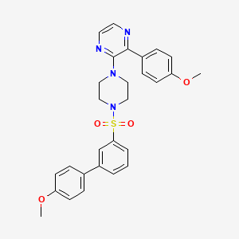

### Introduction

**SMILES** (simplified molecular-input line-entry system) is a classic line notation used in chemistry to describe molecular formulas and uniform scientific communication. **FSMILES** (fragment-based simplified molecular-input line-entry system) notation has been designed by [Feng at al.](https://arxiv.org/pdf/2305.10133.pdf) in the context of **Lingvo3DModel** algorithm development enabling the generation of new 3D molecules.

Example of SMILES and FSMILES notations for **2-{4-\[(4'-Methoxybiphenyl-3-Yl)sulfonyl]piperazin-1-Yl}-3-(4-Methoxyphenyl)pyrazine**

**2D-structure:**

*(image source: [Pubchem](https://pubchem.ncbi.nlm.nih.gov/compound/56955953#section=Structures))*

**SMILES:**
*COC1=CC=C(C=C1)C2=CC(=CC=C2)S(=O)(=O)N3CCN(CC3)C4=NC=CN=C4C5=CC=C(C=C5)OC*

**FSMILES** (provided by Feng et Al.):
*'start_0'O_0=_0S_0(\[\*\])_0(\[\*\])_0=_0O_0'sep_0’N_61_0C_6C_6N_6(\[\*\])_0C_6C_61_0'sep_0’c_61_0n_6c_6c_6n_6c_61_0\[\*\]_0'sep_0’c_61_0c_6c_6c_6(\[\*])_0c_6c_61_0'sep_0’O_0C_0'sep_0’c_61_0c_6c_6c_6c_6(\[\*\])_0c_61_0'sep_0’c_61_0c_6c_6c_6(\[\*\])_0c_6c_61_0'sep_ 0’O_0C_0
'sep_0''end_0'*

-------

### FSMILES features and advantages

**FSMILES** notation has several key features that distinguish it from SMILES:

* All chemical groups (ring tokens as well as acyclic fragments) can be clearly distinguished due to separator **'sep_0'**;

* Each chemical element contains information about **ring size** (number of elements in corresponding ring tokens). Acyclic fragments have ring size equal to zero;

* The **connection points** are explicitely denoted by ([\*]) (or [\*] if a connection point is associated with the last element of the chemical group);

* The **aromaticity** of each token is explicitely defined (elements in uppercase for saturated or acyclic tokens, elements in lowercase for aromatic tokens);

* FSMILES notation starts from acyclic fragment located in the middle of molecule (if exists).

All this information about ring size, connection points, aromaticity and chemical groups are integrated in SMILES notation but FSMILES notation integrates specific explicit pattern of these important features. It makes FSMILES notation longer and less readable for human but useful for **Lingvo3DModel** and potentially for other ML and DL algorithms.

Some advantages for model training highlighted by the authors include:

* FSMILES integrates **local** spherical **coordinate system.** As chemical bond lengths and chemical bond angles are rigid, as well s bond angles can be computed knowing atom type and ring size, FSMILES notation can be converted in **global** Euclidean **coordinate system,** so it is indirectly integrated in FSMILES notation. This combination of local and global coordinate systems in training data helps predict more accurately chemical substructures of generated 3D molecules;

* When generating new molecules with Lingvo3DModel, FSMILES notation used in training data helps prioritize **ring closure** with accurate bond angles and reasonable ring size.

--------

### FSMILES using with transformers

FSMILES has some potential advantages when used with transformers, which are de-facto a gold standard in natural language processing. In transformers, the first step of input data preprocessing is its **tokenization** when the text is divided into tokens (in classic variation each token is a word). Then, tokens are processed by two parallel transformations: **token embedding** (keeps information about token role in the data) and **positional embedding** (keeps information about token position in the data).

Chemical formulas in FSMILES notation are more suitable to use with transformers then formulas in SMILES notaion: chemical groups can be considered as tokens, separators between chemical groups enable token distinction. After tokenization, token embedding vector gets information about local coordinates and token structure, while positional embedding vector -- about global coordinates of a token respectively. These two embedding vectors should be computed better when using FSMILES due to specific patterns in FSMILES notation, that can increase model quality. Experimental results of Feng et al. confirm this hypothesis.
